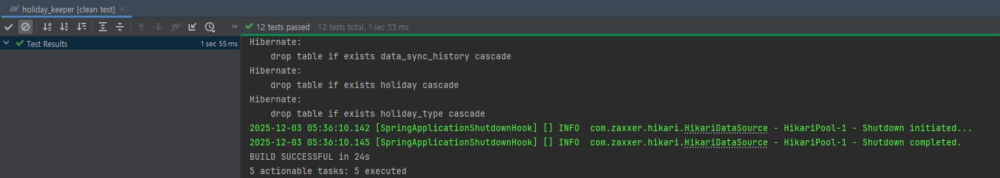
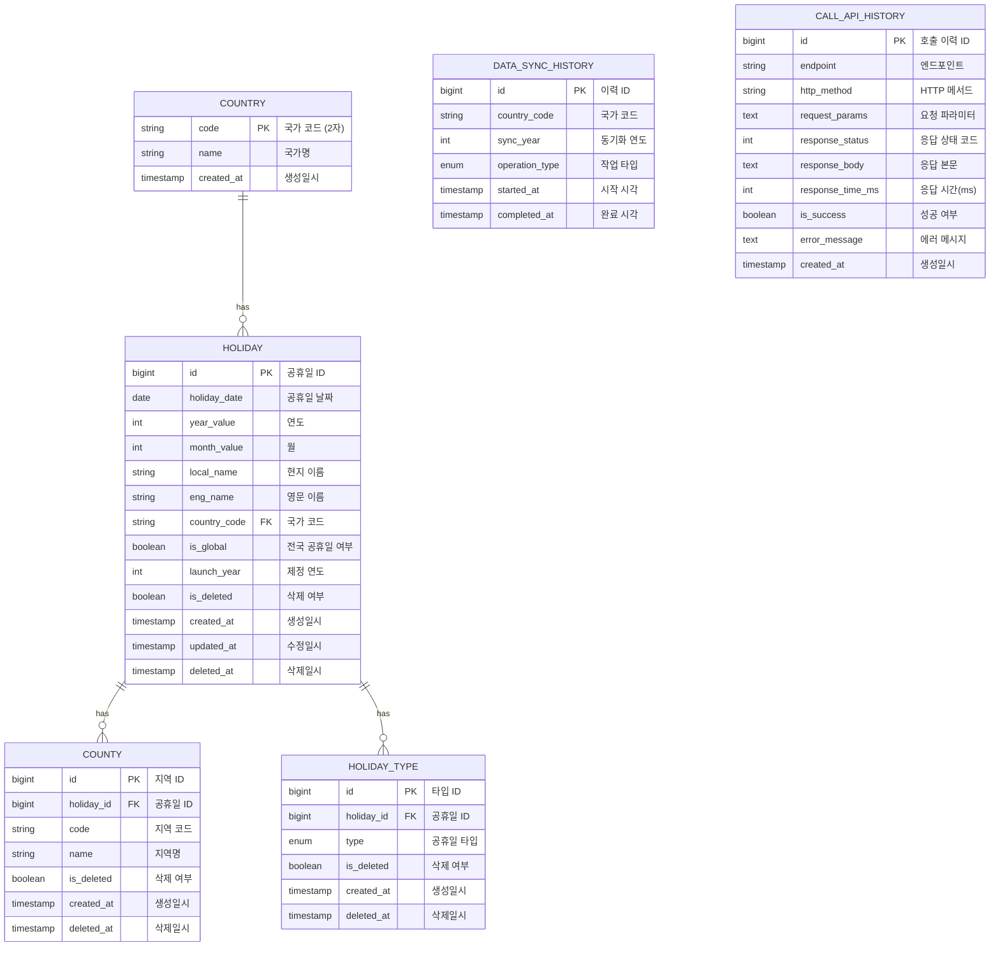

# Holiday Keeper

전 세계 공휴일 정보를 수집, 관리, 조회할 수 있는 REST API 서비스

## 📋 목차

- [기술 스택](#기술-스택)
- [빌드 & 실행 방법](#빌드--실행-방법)
- [API 명세](#api-명세)
- [Swagger UI](#swagger-ui)
- [데이터베이스 스키마](#데이터베이스-스키마)
- [프로젝트 구조](#프로젝트-구조)
- [주요 특징](#주요-특징)

---

## 🛠 기술 스택

- **Java 21**
- **Spring Boot 3.4.12**
- **Spring Data JPA** + **QueryDSL 5.0.0**
- **H2 Database** (In-Memory)
- **JUnit 5**
- **SpringDoc OpenAPI 3** (Swagger)
- **Gradle 8.9**

---

## 🚀 빌드 & 실행 방법

### 1. 사전 요구사항

- Java 21 이상
- Gradle 8.x (Gradle Wrapper 포함)

### 2. 프로젝트 클론

```bash
git clone <repository-url>
cd holiday_keeper
```

### 3. 빌드

**Windows (PowerShell)**
```powershell
.\gradlew clean build
```

**Unix/Mac**
```bash
./gradlew clean build
```


### 4. 실행

```bash
.\gradlew bootRun
```

또는 빌드된 JAR 실행:
```bash
java -jar build/libs/holidaykeeper-0.0.1-SNAPSHOT.jar
```

### 5. 실행 확인

- **애플리케이션**: http://localhost:8080
- **H2 콘솔**: http://localhost:8080/h2-console
    - JDBC URL: `jdbc:h2:mem:holidaydb`
    - Username: `sa`
    - Password: (공백)
- **Swagger UI**: http://localhost:8080/swagger-ui/index.html

### 6. gradlew clean test 성공 사진


---

## 📡 API 명세

### Base URL
```
http://localhost:8080/api/v1/holidays
```

### 1. 데이터 적재 (Load)

외부 API에서 최근 5년간의 공휴일 데이터를 수집하여 저장합니다.

**Request**
```http
POST /api/v1/holidays/load
```

**Response**
```json
{
  "success": true,
  "data": "ok"
}
```

---

### 2. 공휴일 검색 (Search)

다양한 조건으로 공휴일을 검색합니다.

**Request**
```http
ex) GET /api/v1/holidays?year=2025&countryCode=KR&page=0&size=10
```

**Query Parameters**

| 파라미터 | 타입 | 필수 | 설명 | 예시 |
|---------|------|------|------|------|
| year | Integer | X | 연도 | 2025 |
| month | Integer | X | 월 (1-12) | 3 |
| countryCode | String | X | 국가 코드 | KR, US |
| fromDate | LocalDate | X | 시작 날짜 | 2025-01-01 |
| toDate | LocalDate | X | 종료 날짜 | 2025-12-31 |
| types | List&lt;String&gt; | X | 공휴일 타입 (AND 조건) | PUBLIC,BANK |
| page | Integer | X | 페이지 번호 (0부터 시작) | 0 |
| size | Integer | X | 페이지 크기 | 10 |

**Response**
```json
{
  "success": true,
  "data": [
    {
      "id": 1,
      "localName": "설날",
      "englishName": "Lunar New Year",
      "date": "2025-01-29",
      "year": 2025,
      "month": 1,
      "countryCode": "KR",
      "countryName": "South Korea",
      "isGlobal": false,
      "launchYear": 1950
    }
  ]
}
```

**특징**: `types` 파라미터는 **AND 조건**으로 동작합니다.
- 예: `types=PUBLIC,BANK` → PUBLIC **그리고** BANK 타입을 **모두** 가진 공휴일만 조회

---

### 3. 데이터 재동기화 (Refresh)

특정 연도와 국가의 공휴일 데이터를 다시 수집하여 갱신합니다.

**Request**
```http
PUT /api/v1/holidays/refresh
Content-Type: application/json

{
  "year": 2025,
  "countryCode": "KR"
}
```

**Response**
```json
{
  "success": true,
  "data": "ok"
}
```

---

### 4. 데이터 삭제 (Delete)

특정 연도와 국가의 공휴일 데이터를 삭제합니다.

**Request**
```http
DELETE /api/v1/holidays/delete?year=2025&countryCode=KR
```

**Query Parameters**

| 파라미터 | 타입 | 필수 | 설명 |
|---------|------|------|------|
| year | Integer | O | 삭제할 연도 |
| countryCode | String | O | 삭제할 국가 코드 |

**Response**
```json
{
  "success": true,
  "data": "ok"
}
```

---

## 📚 Swagger UI

### 접속 방법

애플리케이션 실행 후 브라우저에서 접속:
```
http://localhost:8080/swagger-ui/index.html
```

### OpenAPI JSON

```
http://localhost:8080/v3/api-docs
```


---

## 📂 프로젝트 구조

### 클린 아키텍처 + 계층형 (Clean Architecture)

```
src/main/java/com/example/holidaykeeper/
├── application/          # Application Layer
│   └── facade/          # Facade 패턴 (여러 도메인 조합)
│       ├── HolidayFacade.java
│       └── request/     # Facade DTO
│
├── domain/              # Domain Layer
│   ├── holiday/         # 공휴일 도메인
│   │   ├── Holiday.java              # 도메인 모델
│   │   ├── HolidayService.java       # 도메인 서비스
│   │   ├── HolidayRepository.java    # Repository 인터페이스
│   │   └── request/                  # 도메인 DTO
│   │
│   └── history/         # 이력 도메인
│       ├── DataSyncHistory.java      # 동기화 이력
│       ├── CallApiHistory.java       # API 호출 이력
│       └── HistoryService.java
│
├── infra/               # Infrastructure Layer
│   ├── holiday/
│   │   ├── HolidayEntity.java        # JPA Entity
│   │   ├── HolidayJpaRepository.java # JPA Repository
│   │   └── HolidayRepositoryImpl.java # Repository 구현체 (QueryDSL 등)
│   │
│   └── history/
│       └── (이력 관련 인프라)
│
├── interfaces/          # Interface Layer
│   └── api/
│       ├── holiday/
│       │   └── HolidayController.java  # REST Controller
│       └── dto/                        # Request/Response DTO
│           ├── SearchHoliday.java
│           ├── RefreshHoliday.java
│           └── DeleteHoliday.java
│
└── support/             # 공통 지원 모듈
    ├── aop/             # AOP (API 이력 기록)
    ├── api/             # 외부 API 클라이언트
    ├── batch/           # Spring Batch
    ├── config/          # 설정 클래스
    ├── exception/       # 예외 처리
    └── filter/          # 필터
```

### 패키지별 역할

| 패키지 | 역할 | 주요 특징 |
|--------|------|----------|
| **application** | 여러 도메인을 조합하는 Facade | Holiday + History 도메인 통합 |
| **domain** | 비즈니스 로직의 핵심 | 순수 Java, 인프라 의존성 없음 |
| **infra** | 데이터베이스, 외부 시스템 연동 | JPA, QueryDSL 구현체 |
| **interfaces** | 외부와의 통신 (REST API) | Controller, DTO |
| **support** | 횡단 관심사 및 공통 기능 | AOP, Config, Exception |

---

## ✨ 주요 특징

### 1. 클린 아키텍처

- **도메인 중심 설계**: 비즈니스 로직을 도메인 레이어에 집중
- **의존성 역전**: 도메인이 인프라를 의존하지 않음 (Repository 인터페이스)
- **관심사 분리**: 각 레이어가 명확한 책임을 가짐

### 2. QueryDSL을 활용한 동적 쿼리

```java
// 복잡한 검색 조건을 타입 안전하게 처리
@Override
public Page<HolidayDetail> searchHolidays(SearchHolidayDomain.Request req, Pageable pageable) {
    BooleanBuilder builder = new BooleanBuilder();
    
    builder.and(yearEq(req.getYear()));
    builder.and(monthEq(req.getMonth()));
    builder.and(hasAllTypes(req.getTypes())); // AND 조건
    
    return queryFactory
        .select(...)
        .from(holidayEntity)
        .where(builder)
        .fetch();
}
```

### 3. AOP를 활용한 API 호출 이력 자동 기록

```java
@Around("controllerMethods()")
public Object logIncomingApiCall(ProceedingJoinPoint joinPoint) {
    // API 호출 정보 자동 저장
    // - 엔드포인트, HTTP 메서드
    // - 요청 파라미터, 응답 본문
    // - 실행 시간, 성공/실패 여부
}
```

### 4. 데이터 변경 이력 관리

공휴일 데이터의 LOAD, REFRESH, DELETE 작업을 `data_sync_history` 테이블에 기록:

```java
// HolidayFacade에서 자동 이력 생성
List<DataSyncHistory> histories = createSyncHistories(
    holidays, 
    OperationTypeEnum.LOAD
);
historyService.saveSyncHistories(histories);
```

### 5. Batch Insert 최적화

```yaml
spring:
  jpa:
    properties:
      hibernate:
        jdbc:
          batch_size: 1000  # 대량 데이터 처리 최적화
        order_inserts: true
        order_updates: true
```

### 6. 외부 API 병렬 호출

```java
// CompletableFuture를 활용한 비동기 병렬 처리
for (Country country : countries) {
    for (int year : recent5Years) {
        CompletableFuture<List<Holiday>> future = 
            CompletableFuture.supplyAsync(
                () -> nagerApi.getPublicHolidays(year, country.getCode()),
                holidayLoadExecutor
            );
        futures.add(future);
    }
}
```

### 7. 전역 예외 처리

```java
@RestControllerAdvice
public class ApiControllerAdvice {
    @ExceptionHandler(MethodArgumentNotValidException.class)
    public ResponseEntity<ResponseData> handleValidationExceptions(...) {
        // 검증 실패 시 일관된 응답 형식
    }
}
```

---

## 🗄️ 데이터베이스 스키마

### 주요 테이블



| 테이블명 | 설명 | 주요 컬럼 |
|---------|------|----------|
| **holiday** | 공휴일 정보 | id, date, local_name, eng_name, country_code |
| **country** | 국가 정보 | code, name |
| **county** | 지역 정보 (공휴일이 특정 지역에만 해당) | id, holiday_id, name |
| **holiday_type** | 공휴일 타입 (1:N 관계) | id, holiday_id, type |
| **data_sync_history** | 데이터 동기화 이력 | id, country_code, sync_year, operation_type |
| **call_api_history** | API 호출 이력 | id, endpoint, http_method, response_status |

### ERD 주요 관계

```
holiday (1) --- (N) holiday_type
holiday (1) --- (N) county
holiday (N) --- (1) country
```

---

## 📝 개발 참고사항

### H2 콘솔 접속

- URL: http://localhost:8080/h2-console
- JDBC URL: `jdbc:h2:mem:holidaydb`
- Username: `sa`
- Password: (공백)

---

## 📌 API 사용 예시

### 1. 데이터 최초 로드

```bash
curl -X POST http://localhost:8080/api/v1/holidays/load
```

### 2. 한국의 2025년 공휴일 조회

```bash
curl -X GET "http://localhost:8080/api/v1/holidays?year=2025&countryCode=KR&page=0&size=10"
```

### 3. PUBLIC과 BANK 타입을 모두 가진 공휴일 조회

```bash
curl -X GET "http://localhost:8080/api/v1/holidays?types=PUBLIC,BANK"
```

### 4. 특정 기간의 공휴일 조회

```bash
curl -X GET "http://localhost:8080/api/v1/holidays?fromDate=2025-01-01&toDate=2025-03-31"
```

---

## 📧 Contact

